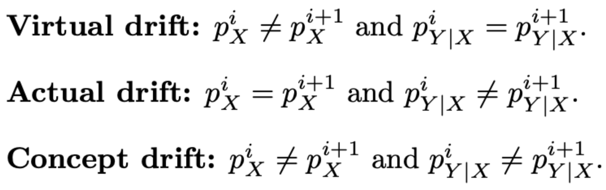
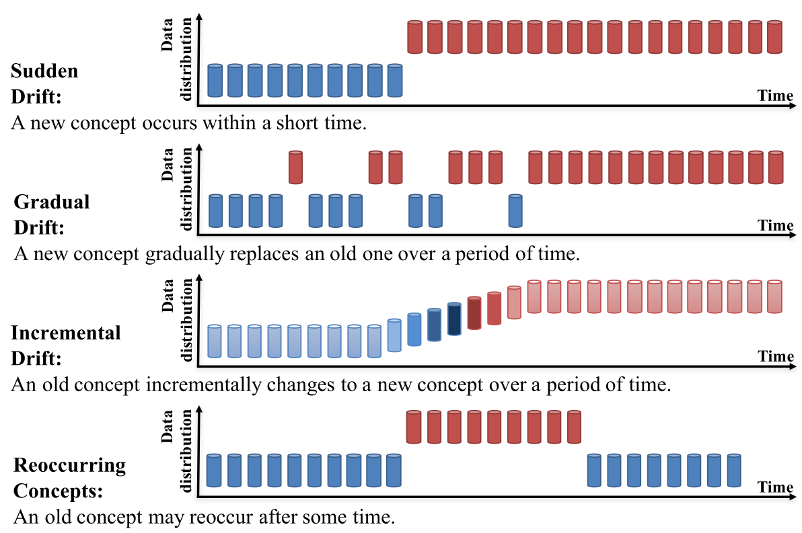

# What is Drift?
## “When the world changes, but the model doesn’t.”
Drift is a change in the joint data distribution P(X,Y) over time.

--

# Types of Drift
## By what changes

--

# Types of Drift
## By how it changes

--

# Why do we Detect Drift?
- Detect changes in data or concept →  model adaptation (e.g. retraining)
- Ensure the model remains accurate and relevant as the world changes

